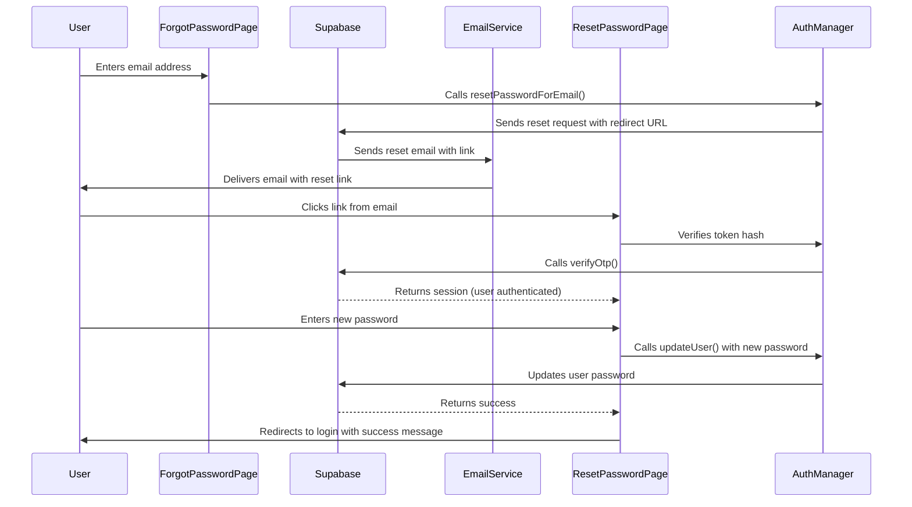

# Password Reset Implementation Plan

## Overview
Implement a secure, user-friendly password reset flow using Supabase Auth with client-side authentication. This plan follows Supabase's implicit flow for password-based authentication.

## Architecture

### Password Reset Flow



## Implementation Steps

### Step 1: Configure Supabase Redirect URLs

**Location**: Supabase Dashboard > Authentication > URL Configuration

**Required URLs to Add:**
- `https://cd-ai-auto-site.vercel.app/user/reset-password.html` - Password reset page
- `https://cd-ai-auto-site.vercel.app/user/login.html` - Login page (for redirect after reset)

**Why**: These URLs must be in the allowlist for password reset links to work properly.

---

### Step 2: Create Forgot Password Page

**File**: `user/forgot-password.html`

**Purpose**: Allow users to request a password reset by entering their email address.

**Features**:
- Email input field with validation
- "Send Reset Link" button
- Loading state during request
- Success message after email sent
- Error handling for invalid emails or rate limits
- Link back to login page
- Consistent neobrutalist design matching existing auth pages

**Form Flow**:
1. User enters email
2. Click "Send Reset Link"
3. Call `authManager.resetPasswordForEmail(email)`
4. Show success message: "If an account exists with this email, you'll receive reset instructions"
5. Disable form to prevent duplicate submissions

**Security Considerations**:
- Rate limiting (handled by Supabase: 1 request per 60 seconds)
- Generic success message (prevents email enumeration)
- Clear error messages (don't reveal if email exists)

---

### Step 3: Create Reset Password Page

**File**: `user/reset-password.html`

**Purpose**: Allow users to set a new password after clicking the reset link from email.

**Features**:
- New password input field
- Confirm password input field
- Password strength indicator
- "Update Password" button
- Loading state during update
- Success/error messages
- Automatic redirect to login after successful reset
- Consistent neobrutalist design
- Handle expired/invalid tokens gracefully

**Form Flow**:
1. Page loads with token hash from URL
2. Verify token using `authManager.verifyOtp()`
3. If valid, show password form
4. If invalid/expired, show error with link to request new reset
5. User enters new password
6. Click "Update Password"
7. Call `authManager.updateUser({ password: newPassword })`
8. Show success message
9. Redirect to login page after 2-3 seconds

**Password Requirements**:
- Minimum 8 characters
- Match confirmation password
- No other restrictions (keep it simple)

**Security Considerations**:
- Token verification before showing form
- Clear error messages for invalid tokens
- Session management (user is authenticated after token verification)
- Automatic logout after password update (invalidates old sessions)

---

### Step 4: Update AuthManager Class

**File**: `supabase.js`

**New Methods to Add**:

#### 1. `resetPasswordForEmail(email)`
```javascript
async resetPasswordForEmail(email) {
  try {
    const { data, error } = await supabase.auth.resetPasswordForEmail(email.trim(), {
      redirectTo: 'https://cd-ai-auto-site.vercel.app/user/reset-password.html'
    });

    if (error) {
      console.error('Password reset error:', error.message);
      return { data: null, error };
    }

    console.log('Password reset email sent to:', email);
    return { data, error: null };
  } catch (error) {
    console.error('Password reset exception:', error);
    return { data: null, error };
  }
}
```

#### 2. `updateUser(updates)`
```javascript
async updateUser(updates) {
  try {
    const { data, error } = await supabase.auth.updateUser(updates);

    if (error) {
      console.error('Update user error:', error.message);
      return { data: null, error };
    }

    console.log('User updated successfully');
    return { data, error: null };
  } catch (error) {
    console.error('Update user exception:', error);
    return { data: null, error };
  }
}
```

#### 3. `verifyResetToken(tokenHash)`
```javascript
async verifyResetToken(tokenHash) {
  try {
    const { data, error } = await supabase.auth.verifyOtp({
      token_hash: tokenHash,
      type: 'recovery'
    });

    if (error) {
      console.error('Token verification error:', error.message);
      return { data: null, error };
    }

    console.log('Token verified successfully');
    return { data, error: null };
  } catch (error) {
    console.error('Token verification exception:', error);
    return { data: null, error };
  }
}
```

---

### Step 5: Update Login Page

**File**: `user/login.html`

**Changes Required**:
- Update "Forgot your password?" link (line 329-330)
- Change from: `onclick="alert('Password reset coming soon'); return false;"`
- Change to: `href="./forgot-password.html"`

**Before**:
```html
<p><a href="#" onclick="alert('Password reset coming soon'); return false;" style="font-weight: 400;">Forgot
    your password?</a></p>
```

**After**:
```html
<p><a href="./forgot-password.html" style="font-weight: 400;">Forgot
    your password?</a></p>
```

---

### Step 6: Add Password Reset Form Validation

**Validation Rules**:

#### Forgot Password Page
- Email format validation (regex: `/^[^\s@]+@[^\s@]+\.[^\s@]+$/`)
- Email not empty
- Prevent submission while loading
- Debounce rapid submissions

#### Reset Password Page
- Password not empty
- Confirm password not empty
- Passwords match
- Password minimum 8 characters
- Password strength indicator (optional, but recommended)
- Prevent submission while loading

**Error Messages**:
- Use clear, user-friendly messages
- Match neobrutalist design style
- Display inline with input fields
- Use coral color for errors (consistent with existing design)

---

### Step 7: Email Template Customization (Optional)

**Location**: Supabase Dashboard > Authentication > Email Templates

**Template**: Reset Password (Recovery)

**Recommended Customizations**:
- Update subject line to match your brand
- Add logo/branding
- Customize email body with your app's design language
- Ensure redirect URL is correct
- Add support email for issues

**Default Variables Available**:
- `{{ .ConfirmationURL }}` - The reset link
- `{{ .Token }}` - 6-digit OTP (if using OTP instead)
- `{{ .TokenHash }}` - Hashed token
- `{{ .SiteURL }}` - Your site URL
- `{{ .Email }}` - User's email address

---

## File Structure

```
user/
├── login.html (modify - update forgot password link)
├── signup.html (no changes)
├── forgot-password.html (new)
└── reset-password.html (new)

supabase.js (modify - add AuthManager methods)
```

---

## Testing Checklist

### Unit Testing
- [ ] Test `resetPasswordForEmail()` with valid email
- [ ] Test `resetPasswordForEmail()` with invalid email format
- [ ] Test `updateUser()` with valid password
- [ ] Test `updateUser()` with short password (< 8 chars)
- [ ] Test `verifyResetToken()` with valid token
- [ ] Test `verifyResetToken()` with expired token
- [ ] Test `verifyResetToken()` with invalid token

### Integration Testing
- [ ] Request password reset from forgot-password page
- [ ] Verify email is received (check Mailpit for local dev)
- [ ] Click reset link from email
- [ ] Enter new password on reset-password page
- [ ] Verify password is updated successfully
- [ ] Attempt to login with new password
- [ ] Attempt to login with old password (should fail)
- [ ] Test expired token scenario
- [ ] Test invalid token scenario
- [ ] Test rate limiting (multiple rapid requests)

### Edge Cases
- [ ] User requests reset for non-existent email (should show generic success)
- [ ] User clicks reset link twice (second attempt should fail)
- [ ] User takes too long to reset password (token expires)
- [ ] User enters mismatched passwords
- [ ] User enters weak password
- [ ] Network error during reset request
- [ ] Network error during password update

---

## Security Considerations

### Rate Limiting
- Supabase provides built-in rate limiting (1 request per 60 seconds)
- Display appropriate message if rate limit hit
- Consider client-side debouncing (500ms) to prevent accidental double submissions

### Email Enumeration Prevention
- Always show generic success message: "If an account exists..."
- Never reveal whether email is registered
- This prevents attackers from checking which emails are in the system

### Token Security
- Tokens expire after 1 hour (default, configurable in Supabase)
- Single-use tokens (invalidated after use)
- Verify token before showing password form
- Clear token from URL after verification

### Session Management
- Old sessions remain valid until they expire naturally
- Consider forcing logout on all devices after password change (optional, can be implemented later)
- User is automatically authenticated after clicking reset link
- Session is created when password is updated

### Password Requirements
- Minimum 8 characters
- No complexity requirements (keep it user-friendly)
- Match confirmation password
- Consider adding strength meter for better UX

---

## User Experience Flow

### Success Path
1. User can't remember password → clicks "Forgot password" on login page
2. Enters email address → clicks "Send Reset Link"
3. Sees success message: "Check your email for reset instructions"
4. Receives email → clicks "Reset Password" link
5. Lands on reset page → enters new password → confirms password
6. Sees success: "Password updated successfully"
7. Automatically redirected to login page after 2 seconds
8. Logs in with new password

### Error Paths
1. Invalid email format → Show inline error below email field
2. Rate limit exceeded → Show "Please wait before requesting another reset"
3. Expired token → Show "Reset link expired. Request a new one."
4. Invalid token → Show "Invalid reset link. Request a new one."
5. Passwords don't match → Show inline error below confirm field
6. Password too short → Show "Password must be at least 8 characters"
7. Network error → Show "Connection error. Please try again."

---

## Implementation Notes

### Neobrutalist Design Consistency
- Use same color palette as login/signup pages
- Thick borders (3px solid)
- Hard shadows (6px 6px 0px 0px var(--ink))
- Hover effects with shadow expansion
- Bold, uppercase labels
- Coral color for errors
- Blue for primary buttons
- Green for success states

### Responsive Design
- Mobile-first approach
- Full-width inputs on mobile
- Proper spacing for touch targets
- Readable text sizes (minimum 16px)

### Accessibility
- Proper ARIA labels
- Keyboard navigation support
- Focus management
- Screen reader friendly error messages
- High contrast ratios

### Browser Compatibility
- Modern browsers (Chrome, Firefox, Safari, Edge)
- Mobile browsers (iOS Safari, Chrome Mobile)
- Graceful degradation for older browsers

---

## Deployment Checklist

### Pre-Deployment
- [ ] Configure redirect URLs in Supabase Dashboard
- [ ] Test all pages locally
- [ ] Test email delivery (check spam folder)
- [ ] Verify all error states
- [ ] Test on mobile devices
- [ ] Test in multiple browsers
- [ ] Update any documentation

### Post-Deployment
- [ ] Monitor email delivery rates
- [ ] Check for any error reports
- [ ] Verify reset links work in production
- [ ] Test with real user emails
- [ ] Update user documentation/help if needed

---

## Future Enhancements (Optional)

### Phase 2 Features
- Password strength meter with visual indicator
- Show/hide password toggle
- Force logout on all devices after password change
- Remember me option on reset page
- Password history (prevent reuse of recent passwords)
- MFA integration for password reset
- Admin notification for password changes
- Analytics tracking for reset flow

### Phase 3 Features
- Multiple email addresses per account
- SMS password reset option
- Security questions (optional)
- Biometric reset options (mobile)

---

## Code Examples

### Forgot Password Page Structure
```html
<!DOCTYPE html>
<html lang="en">
<head>
  <meta charset="UTF-8" />
  <title>Forgot Password – Ai-Auto</title>
  <!-- Meta tags, fonts, styles similar to login.html -->
</head>
<body>
  <div class="auth-container">
    <div class="auth-card">
      <div class="auth-header">
        <h1>Reset Password</h1>
        <p>Enter your email to receive reset instructions</p>
      </div>

      <form id="forgotPasswordForm">
        <div class="form-group">
          <label for="email">Email Address</label>
          <input type="email" id="email" name="email" placeholder="you@example.com" required>
          <div class="error-message" id="emailError"></div>
        </div>

        <button type="submit" class="submit-btn" id="submitBtn">Send Reset Link</button>
      </form>

      <div class="auth-footer">
        <p>Remember your password? <a href="./login.html">Sign in</a></p>
      </div>
    </div>
  </div>

  <script src="https://cdn.jsdelivr.net/npm/@supabase/supabase-js@2"></script>
  <script src="../supabase.js"></script>
  <script>
    // Form handling code here
  </script>
</body>
</html>
```

### Reset Password Page Structure
```html
<!DOCTYPE html>
<html lang="en">
<head>
  <meta charset="UTF-8" />
  <title>Reset Password – Ai-Auto</title>
  <!-- Meta tags, fonts, styles -->
</head>
<body>
  <div class="auth-container">
    <div class="auth-card">
      <div class="auth-header">
        <h1>Set New Password</h1>
        <p>Enter your new password below</p>
      </div>

      <!-- Token verification state -->
      <div id="verifyingState">
        <p>Verifying reset link...</p>
      </div>

      <!-- Password form state -->
      <form id="resetPasswordForm" style="display: none;">
        <div class="form-group">
          <label for="password">New Password</label>
          <input type="password" id="password" name="password" placeholder="••••••••••" required minlength="8">
          <div class="error-message" id="passwordError"></div>
        </div>

        <div class="form-group">
          <label for="confirmPassword">Confirm Password</label>
          <input type="password" id="confirmPassword" name="confirmPassword" placeholder="••••••••••" required minlength="8">
          <div class="error-message" id="confirmPasswordError"></div>
        </div>

        <button type="submit" class="submit-btn" id="submitBtn">Update Password</button>
      </form>

      <!-- Success state -->
      <div id="successState" style="display: none;">
        <h2>Password Updated!</h2>
        <p>Your password has been successfully reset.</p>
        <p>Redirecting to login...</p>
      </div>

      <!-- Error state -->
      <div id="errorState" style="display: none;">
        <h2>Invalid or Expired Link</h2>
        <p>This reset link is invalid or has expired.</p>
        <a href="./forgot-password.html" class="submit-btn">Request New Reset Link</a>
      </div>

      <div class="auth-footer">
        <p>Remember your password? <a href="./login.html">Sign in</a></p>
      </div>
    </div>
  </div>

  <script src="https://cdn.jsdelivr.net/npm/@supabase/supabase-js@2"></script>
  <script src="../supabase.js"></script>
  <script>
    // Form handling code here
  </script>
</body>
</html>
```

---

## Summary

This implementation provides:
- ✅ Secure password reset flow using Supabase Auth
- ✅ Client-side authentication (implicit flow)
- ✅ User-friendly neobrutalist design
- ✅ Proper error handling and validation
- ✅ Protection against email enumeration
- ✅ Rate limiting via Supabase
- ✅ Mobile-responsive design
- ✅ Accessible interface
- ✅ Consistent with existing auth pages

**Estimated Complexity**: Medium
**Files to Create**: 2 new HTML pages
**Files to Modify**: 1 HTML page, 1 JavaScript file
**Supabase Configuration**: Add 2 redirect URLs to allowlist
**Testing Required**: End-to-end flow testing
